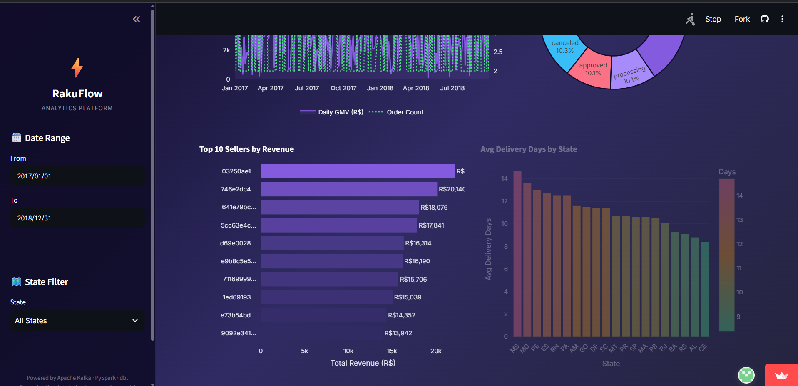
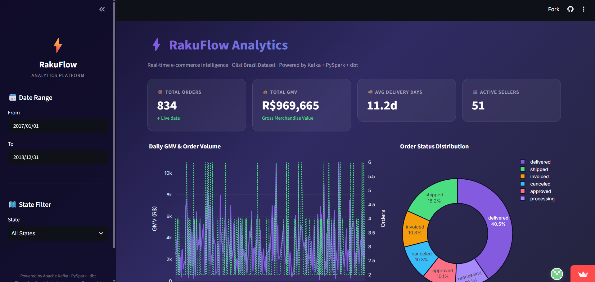
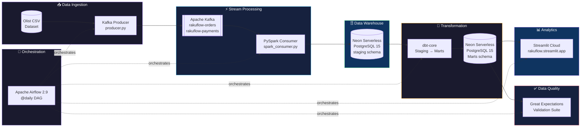

# ⚡ RakuFlow — Production-Grade E-Commerce Data Engineering Pipeline

> 🔴 **Live Demo**: [https://rakuflow.streamlit.app](https://rakuflow.streamlit.app)  
> _(Dashboard fully cloud-hosted on Streamlit Community Cloud and powered by Neon Serverless PostgreSQL)_
> ### KPI Cards · Daily GMV · Order Status
>

>### Top 10 Sellers · Avg Delivery Days by State
>

> A Rakuten-scale, fully Dockerized, end-to-end data engineering platform for e-commerce order analytics — built with Apache Kafka, PySpark, Apache Airflow, dbt, PostgreSQL, Great Expectations, and Streamlit.

[](https://github.com/j26219096-prog/rakuflow/actions/workflows/ci.yml)
[](https://github.com/j26219096-prog/rakuflow/actions/workflows/integration.yml)
[](https://codespaces.new/j26219096-prog/rakuflow)
[](https://python.org)
[](https://kafka.apache.org)
[](https://spark.apache.org)
[](https://airflow.apache.org)
[](https://getdbt.com)
[](https://postgresql.org)
[](https://streamlit.io)
[](https://docker.com)
[](LICENSE)

---

## 🏗️ Architecture



---

## 🚀 Quick Start

### Prerequisites
- Docker Desktop (v24+) with at least 8 GB RAM allocated
- Docker Compose v2
- `make` (Git Bash / WSL on Windows)
- Python 3.11+ (for local development only)

### 1. Clone the repository
```bash
git clone https://github.com/j26219096-prog/rakuflow.git
cd rakuflow
```

### 2. Configure environment variables
```bash
make init          # copies .env.example → .env
# Edit .env and set your POSTGRES_PASSWORD and AIRFLOW_FERNET_KEY
```

Generate a Fernet key:
```bash
python -c "from cryptography.fernet import Fernet; print(Fernet.generate_key().decode())"
```

### 3. Add the dataset
Download the [Olist Brazilian E-Commerce Dataset](https://www.kaggle.com/datasets/olistbr/brazilian-ecommerce) from Kaggle and place CSVs in `data/raw/`:
```
data/raw/
├── olist_orders_dataset.csv
├── olist_order_payments_dataset.csv
├── olist_customers_dataset.csv
├── olist_sellers_dataset.csv
└── olist_order_items_dataset.csv
```

### 4. Start all services
```bash
make up
```
Wait ~60 seconds for Kafka and Airflow to initialize.

### 5. Run the full pipeline
```bash
make run           # Kafka producer → Spark consumer → PostgreSQL staging
make dbt-run       # dbt models → mart tables
make dashboard     # Open Streamlit on http://localhost:8501
```

### Service URLs
| Service          | URL                           | Credentials   |
|-----------------|-------------------------------|---------------|
| Airflow UI      | http://localhost:8080         | admin / admin123 |
| Streamlit       | http://localhost:8501         | —             |
| PostgreSQL      | localhost:5432                | See .env      |
| Kafka           | localhost:9092                | —             |

---

## 🚀 Run Directly on GitHub (No Local Setup)

### Option A — GitHub Codespaces (Zero Install)

Click the button in the README or go to **Code → Codespaces → Create codespace on main**.

The devcontainer automatically:
- Installs all Python dependencies
- Forwards ports for Airflow (8080), Streamlit (8501), Postgres (5432), Kafka (9092)
- Opens the Streamlit dashboard in your browser

Then run the pipeline from the Codespace terminal:
```bash
make up          # start Kafka + Airflow + Streamlit
make simple-run  # producer → simple consumer → PostgreSQL
make dbt-run     # dbt staging + marts
make dashboard   # open Streamlit
```

### Option B — GitHub Actions (Automated CI/CD)

Every push and pull request automatically triggers:

| Workflow | Trigger | What it does |
|---|---|---|
| **CI** ([`.github/workflows/ci.yml`](.github/workflows/ci.yml)) | Push / PR to `main`, `develop` | Lint (ruff) + unit tests |
| **Integration** ([`.github/workflows/integration.yml`](.github/workflows/integration.yml)) | Push to `main` / manual | Full pipeline: Kafka → Postgres → dbt → data quality assertions |

The integration workflow spins up real **Kafka** and **PostgreSQL** service containers inside GitHub Actions and runs the entire pipeline end-to-end — no local Docker required.

**To trigger the integration pipeline manually:**
1. Go to your repo → **Actions** → **Integration — Pipeline E2E Test**
2. Click **Run workflow** → **Run workflow**

> **Note:** The badges and Codespace buttons are now fully configured for the repository.

---

## 📁 Project Structure

```
rakuflow/
├── data/
│   └── raw/                    # Olist CSV files (not tracked in git)
├── ingestion/
│   ├── producer.py             # Kafka producer — reads CSVs, publishes events
│   └── schemas.py              # Typed dataclasses for OrderEvent, PaymentEvent
├── processing/
│   └── spark_consumer.py       # PySpark batch job — Kafka → PostgreSQL staging
├── dbt_project/
│   ├── dbt_project.yml         # dbt configuration
│   ├── profiles.yml            # PostgreSQL connection profiles
│   └── models/
│       ├── staging/            # stg_orders, stg_customers, stg_sellers
│       ├── marts/              # fact_orders, dim_customers, dim_sellers, agg_daily_gmv
│       └── schema.yml          # Column tests and source definitions
├── dags/
│   └── rakuflow_dag.py         # Airflow DAG — orchestrates full pipeline
├── quality/
│   └── expectations.py         # Great Expectations validation suites
├── dashboard/
│   ├── app.py                  # Streamlit analytics dashboard
│   ├── Dockerfile              # Container for dashboard service
│   └── requirements-dashboard.txt
├── tests/
│   ├── test_producer.py        # Unit tests — schemas, producer, CSV generator
│   └── test_spark_consumer.py  # Unit tests — Spark transformations
├── docker/
│   └── init.sql                # PostgreSQL schema initialization
├── docker-compose.yml          # Full service orchestration
├── Makefile                    # Developer commands
├── requirements.txt            # Pinned Python dependencies
├── .env.example                # Environment variable template
├── .gitignore
└── README.md
```

---

## 🔄 Pipeline Stages

### Stage 1 — Ingestion (Kafka Producer)
- Reads `olist_orders_dataset.csv` row-by-row with a 100ms artificial delay
- Publishes `OrderEvent` messages to `rakuflow-orders` topic
- Publishes `PaymentEvent` messages to `rakuflow-payments` topic
- Uses typed Python dataclasses for schema enforcement

### Stage 2 — Stream Processing (PySpark)
- Consumes all messages from Kafka topics in batch mode
- Cleans data: drops nulls, parses timestamps, casts types
- Enriches orders with customer city/state via CSV lookup join
- Deduplicates on `order_id` (keeps latest event)
- Writes to `staging.raw_orders` and `staging.raw_payments` via JDBC

### Stage 3 — Transformation (dbt)
**Staging layer** (views over PostgreSQL staging):
- `stg_orders` — renamed columns, timestamp casting, status filtering
- `stg_customers` — deduplication, city normalization
- `stg_sellers` — deduplication, state normalization

**Mart layer** (materialized tables):
- `fact_orders` — one row per order with dimension keys and metrics
- `dim_customers` — SCD Type 1 customer dimension
- `dim_sellers` — seller dimension with order/revenue aggregates
- `agg_daily_gmv` — daily GMV rollup for dashboard

### Stage 4 — Data Quality (Great Expectations)
- Validates `fact_orders`: not_null PKs, payment range, status set
- Validates `dim_customers`: unique keys, valid state codes
- Halts pipeline on validation failure

### Stage 5 — Analytics (Streamlit)
- **KPI Cards**: Total Orders · Total GMV · Avg Delivery Days · Active Sellers
- **Chart 1**: Daily GMV trend with dual-axis order volume overlay
- **Chart 2**: Top 10 sellers by revenue (horizontal bar)
- **Chart 3**: Order status distribution (donut chart)
- **Chart 4**: Average delivery days by state (color-coded bar)
- Sidebar filters: date range + Brazilian state

---

## 📊 Data Model

### staging.raw_orders
```
┌──────────────────────────┬───────────────┬─────────────┐
│ Column                   │ Type          │ Notes       │
├──────────────────────────┼───────────────┼─────────────┤
│ order_id (PK)            │ VARCHAR(255)  │ Not null    │
│ customer_id              │ VARCHAR(255)  │ Not null    │
│ order_status             │ VARCHAR(50)   │             │
│ purchase_timestamp       │ TIMESTAMP     │             │
│ approved_at              │ TIMESTAMP     │             │
│ delivered_carrier_date   │ TIMESTAMP     │             │
│ delivered_customer_date  │ TIMESTAMP     │             │
│ estimated_delivery_date  │ TIMESTAMP     │             │
│ customer_city            │ VARCHAR(255)  │ Enriched    │
│ customer_state           │ CHAR(2)       │ Enriched    │
│ ingested_at              │ TIMESTAMP     │ Auto-set    │
└──────────────────────────┴───────────────┴─────────────┘
```

### marts.fact_orders
```
┌──────────────────────────┬───────────────┬─────────────────────────┐
│ Column                   │ Type          │ Notes                   │
├──────────────────────────┼───────────────┼─────────────────────────┤
│ order_id (PK)            │ VARCHAR(255)  │ Unique, not null        │
│ customer_key (FK)        │ VARCHAR(255)  │ → dim_customers         │
│ seller_key (FK)          │ VARCHAR(255)  │ → dim_sellers           │
│ payment_value            │ NUMERIC(12,2) │ Total payment per order │
│ order_status             │ VARCHAR(50)   │ Accepted values tested  │
│ order_purchase_timestamp │ TIMESTAMP     │                         │
│ delivery_days            │ NUMERIC       │ Computed: deliver-purch │
│ is_delivered             │ BOOLEAN       │ status = 'delivered'    │
│ customer_state           │ CHAR(2)       │                         │
└──────────────────────────┴───────────────┴─────────────────────────┘
```

### marts.agg_daily_gmv
```
┌───────────────────────┬──────────────┬──────────────────────────────┐
│ Column                │ Type         │ Notes                        │
├───────────────────────┼──────────────┼──────────────────────────────┤
│ order_date (PK)       │ DATE         │ Unique per date              │
│ total_orders          │ BIGINT       │ Count of distinct orders     │
│ total_gmv             │ NUMERIC(12,2)│ Sum of payment_value         │
│ avg_payment_value     │ NUMERIC(12,2)│ Average order value          │
│ delivered_orders      │ BIGINT       │ Count of delivered orders    │
│ avg_delivery_days     │ NUMERIC(5,1) │ Average delivery duration    │
└───────────────────────┴──────────────┴──────────────────────────────┘
```


## 🇯🇵 Why This Project (Rakuten Relevance)

Rakuten Group operates one of the world's largest e-commerce ecosystems across 30+ countries, processing millions of orders daily. This project directly mirrors the real-world challenges Rakuten's data engineering teams solve:

| Business Problem | RakuFlow Solution |
|---|---|
| Real-time order ingestion at scale | Apache Kafka with typed schemas |
| High-throughput data transformation | PySpark batch processing |
| Reliable daily analytics pipeline | Airflow @daily DAG with retries |
| Consistent data model for analytics | dbt staging + mart layers |
| Data quality before reporting | Great Expectations validation |
| Self-serve analytics for merchants | Streamlit GMV & seller dashboard |

The dataset (Olist Brazilian E-Commerce) contains 100K+ orders — exactly the scale suitable for showcasing production-grade engineering patterns.

---

## 🛠️ Makefile Reference

```bash
make up          # Start all Docker services
make down        # Stop all services
make logs        # Stream live logs
make reset       # Destroy containers + volumes (destructive!)
make run         # Run producer + Spark consumer
make dbt-run     # Run dbt models + tests
make dashboard   # Open Streamlit on port 8501
make quality     # Run Great Expectations suite
make test        # Run Python unit tests
make lint        # Run code linter (ruff)
make install     # Install Python dependencies
make init        # Initialize .env from template
```

---

## 🧪 Running Tests

```bash
# Unit tests only (no Docker required)
make test

# With coverage
pytest tests/ -v --cov=ingestion --cov=processing --cov-report=html
```

---

## ⚙️ Configuration

All configuration is managed via `.env` (never committed). Key variables:

| Variable | Description | Default |
|---|---|---|
| `POSTGRES_PASSWORD` | PostgreSQL password | _(required)_ |
| `POSTGRES_DB` | Database name | `rakuflow` |
| `KAFKA_BOOTSTRAP_SERVERS` | Kafka broker address | `localhost:9092` |
| `MESSAGE_DELAY_SEC` | Producer delay between events | `0.1` |
| `AIRFLOW_FERNET_KEY` | Airflow encryption key | _(required)_ |
| `ALERT_EMAIL` | Email for pipeline failure alerts | _(optional)_ |

---

## 📦 Tech Stack

| Layer | Technology | Version |
|---|---|---|
| Language | Python | 3.11 |
| Messaging | Apache Kafka | 7.5.0 (Confluent) |
| Processing | Apache Spark (PySpark) | 3.5.1 |
| Orchestration | Apache Airflow | 2.9.0 |
| Transformation | dbt-core + dbt-postgres | 1.8.1 |
| Data Warehouse | PostgreSQL | 15 |
| Data Quality | Great Expectations | 0.18.19 |
| Dashboard | Streamlit + Plotly | 1.35.0 |
| Containers | Docker + Docker Compose | v2 |

---

## 📄 License

This project is licensed under the **MIT License** — see the [LICENSE](LICENSE) file for details.

---

## 🤝 Contributing

Contributions are welcome! Please read [CONTRIBUTING.md](CONTRIBUTING.md) for guidelines on setting up a development environment, running tests, code style, and submitting pull requests.

---

<div align="center">
  <strong>Built  for Data Engineer Internship </strong><br>
  <sub>⚡ RakuFlow — Where every order tells a story</sub>
</div>
